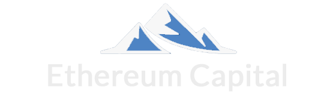
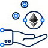
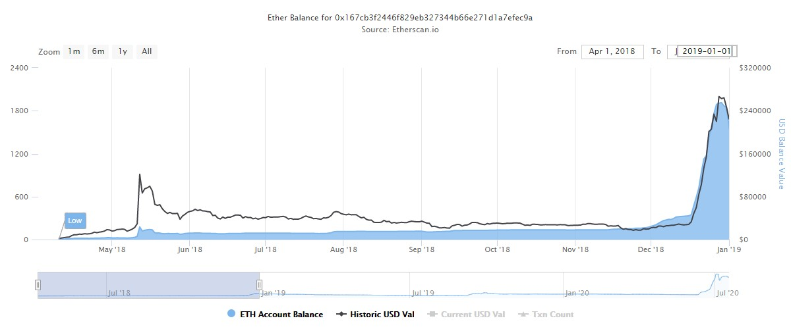
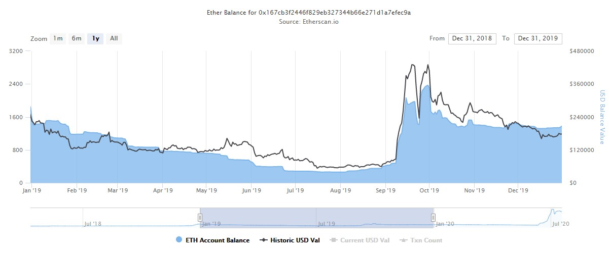
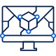
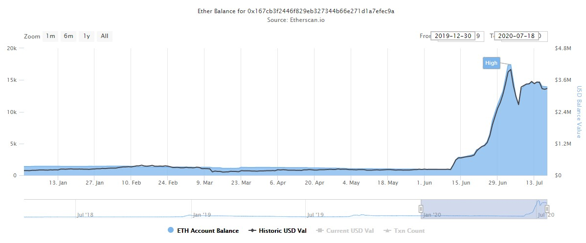

<!DOCTYPE html>

<html>
    <head>
        <title>Ethereum Capital</title>
        <meta charset="UTF-8">
        <meta name="viewport" content="width=device-width, initial-scale=1.0">

        <link rel="icon" href="images/favicon.jpg">
        <link href="css/bootstrap.min.css" rel="stylesheet" type="text/css"/>
        <link href="css/font-awesome.min.css" rel="stylesheet" type="text/css"/>
        <link href="css/style.css" rel="stylesheet" type="text/css"/>
    </head>
    <body>
        

            <header>
                <nav class="navbar navbar-expand-sm navbar-dark fixed-top">
                    

                        

                            <a href="#">
                                
                                Menu
                            </a>
                        

                        
                        <ul class="navbar-nav">
                            <li class="nav-item current-menu-item">
                                <a class="nav-link" href="#">HOW IT WORKS</a>
                            </li>
                            <li class="nav-item">
                                <a class="nav-link" href="#">Account</a>
                            </li>
                            <li class="nav-item">
                                <a class="nav-link" href="https://ethereumcapital.tech/">Backup Link 1</a>
                            </li>
                            <li class="nav-item">
                                <a class="nav-link" href="https://ethereumgold.io/">Backup LInk 2</a>
                            </li>
                            <li class="nav-item">
                                <a class="nav-link" href="https://etherscan.io/address/0x167cb3f2446f829eb327344b66e271d1a7efec9a">Verified & Audited Contract</a>
                            </li>
                            <li class="nav-item">
                                <a class="nav-link" href="https://discord.gg/2JYfAvm">Discord</a>
                            </li>
                        </ul>
                        

                            <a href="#"><i class="fa fa-search"></i></a>
                        

                    

                </nav>
            </header>

            

                

                    <section class="home-banner-wrap">

                        

                            <h1 class="fw-500">Life-Long Passive Income Ethereum Dividends.</h1>
                            <h3 class="fw-400">Protected by the blockchain, theft-proof, audited and time-tested.</h3>
                            <h3 class="fw-400 mb-5rem">Your Ethereum is safely stored in a vault on the blockchain for which only you have the keys.</h3>
                            <h1 class="fw-500"><a href="#">Enter Now</a></h1>
                            

                        

                    </section>
                    <section class="home-service-wrap">
                        

                            

                                

                                    

                                        

                                            

                                                

                                                    

                                                        
                                                    

                                                

                                                

                                                    <h3 class="info-box-title text-primary">Earning Dividends</h3> 
                                                    

                                                        
Unlike passive income investments that promise you 1% per day, at Ethereum Capital the daily percentage gain fluctuates. Income is generated when investors buy, sell, or transfer Ethereum Credits. The fee to buy Ethereum Credits is 20%, you will see this deducted as soon as you deposit, 10% is distributed immediately to all investors including you, when you sell, the other 10% is released to all remaining investors. This process and the handling of all funds including the distribution of all Ethereum is completely managed by the immutable smart contract.

                                                    

                                                

                                            

                                        

                                        <h3 class="mb-30 text-primary">2018 Growth Chart</h3>
                                        <h6 class="mb-35">Data is taken from the Ethereum Blockchain – USD values are approximate.</h6>
                                        

<small class="vc_label">Ethereum Credit Price Appreciation 836%</small>

<small class="vc_label">Total Ethereum Volume 2960 ETH</small>

<small class="vc_label">Dividends Paid (Approx) $141,600</small>

                                        <figure class="mb-35">
                                            
                                        </figure>
                                    

                                

                                

                                    

                                        

                                            

                                                

                                                    

                                                        
                                                    

                                                

                                                

                                                    <h3 class="info-box-title text-primary">How Much Can I Earn by Depositing Ethereum?</h3> 
                                                    

                                                        
You can earn Ethereum passively in three ways.&nbsp; The dividends that are generated as people buy and sell Ethereum Credits,&nbsp; as Ethereum is deposited into the contract the value of each Ethereum Credit increases, so your initial deposit can be worth even more than you deposited. Some experts say the Ethereum price is expected to outpace the growth of Bitcoin, since the contract pays you in Ethereum everything you earn can be worth more and more.

                                                    

                                                

                                            

                                        

                                        <h3 class="mb-30 text-primary">2019 Growth Chart</h3>
                                        <h6 class="mb-35">Data is taken from the Ethereum Blockchain – USD values are approximate.</h6>
                                        

<small class="vc_label">Ethereum Credit Price Appreciation 612%</small>

<small class="vc_label">Total Ethereum Volume 5293 ETH</small>

<small class="vc_label">Dividends Paid (Approx) $285,150</small>

                                        <figure class="mb-35">
                                            
                                        </figure>
                                    

                                

                                

                                    

                                        

                                            

                                                

                                                    

                                                        
                                                    

                                                

                                                

                                                    <h3 class="info-box-title text-primary">Is my Ethereum Safe?</h3> 
                                                    

                                                        
Your Ethereum is as safe as it would be in your own Exodus or Hardware wallet because it is literally on the blockchain. Not only can you withdraw your dividends at anytime you also have the opportunity to reinvest your dividends for future growth. Your funds are never locked up, you can withdraw dividends and can cash out all or part of your Ethereum credits at any time, at your own free will. The smart contract is programmed to do certain functions , like allowing you to withdraw or walk away with your Ethereum at any time.

                                                    

                                                

                                            

                                        

                                        <h3 class="mb-30 text-primary">2020 Growth Chart</h3>
                                        <h6 class="mb-35">(Incomplete) Data is taken from the Ethereum Blockchain – USD values are approximate.</h6>
                                        

<small class="vc_label">Ethereum Credit Price Appreciation so far 381%</small>

<small class="vc_label">Total Ethereum Volume 11,118 ETH</small>

<small class="vc_label">Dividends Paid (so far) $413,000</small>

                                        <figure class="mb-35">
                                            
                                        </figure>
                                    

                                

                            

                        

                        

                            

                                

                                    
Unlike any other passive crypto platform no one can ever change the rules or lock you out, as the contract operates with AI intelligence and can never be stopped by anyone, including any government or even its creator.

                                

                            

                        

                    </section>
                

            

            <footer class="footer-container">
                

                    <aside class="footer-sidebar row">
                        

                            <!--<h5 class="widget-title">Connected Wallet Balance : </h5>
                            <h5 class="widget-title">Current Ethereum Price : USD $ 319.48</h5>-->
                            

                                
                            

                        

                        

                            

                                <h5 class="widget-title">Quick Links</h5>
                                

                                    <ul class="menu">
                                        <li class="current_page_item"><a href="index.html">HOW IT WORKS</a></li>
                                        <li><a href="#">Account</a></li>
                                        <li><a href="https://ethereumcapital.tech/">Backup Link 1</a></li>
                                        <li><a href="https://ethereumgold.io/">Backup LInk 2</a></li>
                                        <li><a href="https://etherscan.io/address/0x167cb3f2446f829eb327344b66e271d1a7efec9a">Verified &amp; Audited Contract</a></li>
                                        <li><a href="https://discord.gg/2JYfAvm">Discord</a></li>
                                    </ul>
                                

                            
 
                        

                    </aside>
                

                

                    

                        

                            

                                <small><a href="#"><strong>Ethereum Capital Wallet</strong></a> <i class="fa fa-copyright"></i> 2020.</small> 
                            

                            

                                

                                    
                                    
                                    
                                    
                                    
                                    
                                    
                                    
                                    
                                    
                                    
                                    
                                    
                                    
                                    
                                    
                                    
                                    
                                

                            

                        

                    

                

            </footer>
        

        

        
        

            

                

                    <ul class="navbar-nav site-mobile-menu">
                        <li class="nav-item current-menu-item">
                            <a class="nav-link" href="#">HOW IT WORKS</a>
                        </li>
                        <li class="nav-item">
                            <a class="nav-link" href="#">Account</a>
                        </li>
                        <li class="nav-item">
                            <a class="nav-link" href="https://ethereumcapital.tech/">Backup Link 1</a>
                        </li>
                        <li class="nav-item">
                            <a class="nav-link" href="https://ethereumgold.io/">Backup LInk 2</a>
                        </li>
                        <li class="nav-item">
                            <a class="nav-link" href="https://etherscan.io/address/0x167cb3f2446f829eb327344b66e271d1a7efec9a">Verified & Audited Contract</a>
                        </li>
                        <li class="nav-item">
                            <a class="nav-link" href="https://discord.gg/2JYfAvm">Discord</a>
                        </li>
                    </ul>
                

            

        

        <!--

            close
            <form role="search" method="get" class="searchform " action="https://ethereumcapitalwallet.com/">
                <input type="text" class="s form-control" placeholder="Search for posts" value="" name="s">
                <input type="hidden" name="post_type" value="post">
                <button type="submit" class="searchsubmit">
                    Search </button>
            </form>
            
Start typing to see posts you are looking for.

        
-->

        
        
        
        
        

    </body>
</html>
